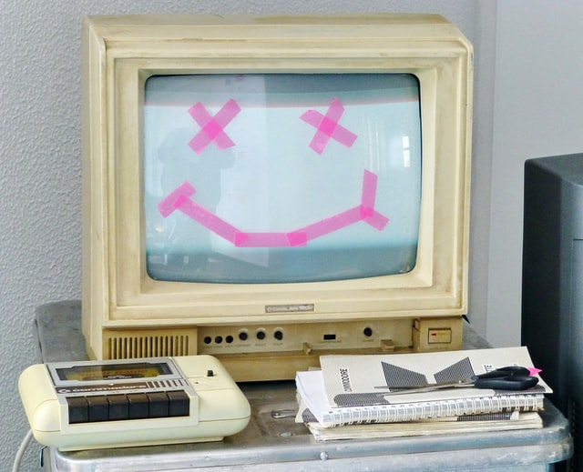

<h1 text-align="centre">The Crushing Bugs Assignment</h1>
This is an assignment based on a simple puzzle peice with a few bugs to fix. The Bugs are as listed below:
<ul>
<li>user can drop multiple pieces (incorrect or correct) to any drop section</li>
<li>more than one puzzle piece can be droppped into one drop zone</li>
<li>puzzle sets do not reset when a new puzzle is selected</li>
<li>background images cannot be changed</li>
</ul>

Solution
<ul>
<li>Dropzones and puzzle pieces match the data sets</li>
<li>function created to allow one piece to be dropped in one zone and then a resturn statement to prevent wrong puzzle pieces to be placed in incorrect drop zone</li>
</ul>

<h2>How to Play</h2>
This is a simple puzzle, where there are four peices in each puzzle for you to drag and drop in order to make the picture whole again. 
There is a drag section, where the scrambled puzzle peices are.
There is the drop section where you drop the chosen puzzle peice into the correct area.

<h2>Meet the Creator:</h2>
<ul>
<li>Evica Mai <a href="https://github.com/evica-ai">@evica-ai</a></li>
</ul>

<h3>Prerequisites</h3>
All you need is a browser with a working Internet connection, as well as git bash and of course, a github account to download.

<h3>Built with:</h3>
<ul>
<li><a href="https://www.w3.org/Style/CSS/Overview.en.html">CSS</a></li>
<li><a href="https://developer.mozilla.org/en-US/docs/Web/CSS/CSS_Animations">CSS Animations</a></li>
<li><a href="https://www.w3schools.com/js/DEFAULT.asp">Javascript</a></li>
</ul>

<h3>Usage<h3>
Check the main branch, clone/download the project (cd to your chosen directory)

<h2>License: MIT</h2>
